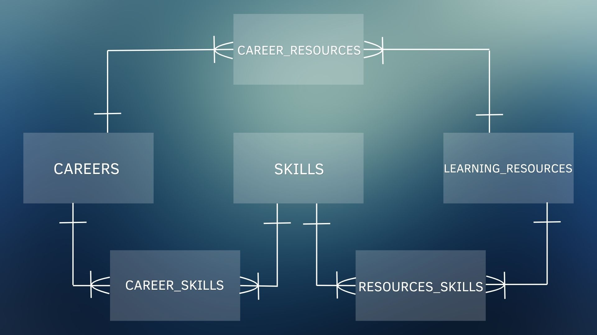

# Career Learning Navigator

A SQLite database that connects career-related skills with suggested learning resources.

Developed as my final project for CS50’s Introduction to Databases with SQL.

## About the Project

When exploring a new career, it can be difficult to know which skills to study or where to find learning resources. This project provides a starting point by connecting selected skills with resources for three careers:

- Data Analyst
- Analytics Engineer
- Data Engineer

The idea came from my own experience exploring a career in data analytics and deciding what to study next.

## Features

The database supports queries to:

- List the skills associated with a career.
- Find suggested learning resources, including their URLs and free or paid access information.
- Explore skills to study by excluding those a user already knows.
- Compare skills across careers.
- Identify resources that address the most skills recorded in the database.

## Database Structure

The database includes six tables:

- `careers`: career names and descriptions.
- `skills`: selected skills.
- `learning_resources`: resource titles, providers, types, URLs, and access costs.
- `career_skills`: associations between careers and skills.
- `resource_skills`: associations between resources and skills.
- `career_resources`: resources selected for each career.

The `career_learning_paths` view brings together careers, skills, and suggested resources. Composite unique indexes support lookups and prevent duplicate associations.

## Entity Relationship Diagram



## Project Files

- `schema.sql`: statements that create the tables, indexes, and view.
- `queries.sql`: career insertion statements, CSV import instructions, and example queries.
- `DESIGN.md`: detailed documentation of the scope, entities, relationships, optimizations, and limitations.
- `image.png`: the entity relationship diagram.
- CSV files: data used to populate the database.

## Exploring the Database

The SQLite command-line tool is required to run this project.

1. Download or clone this repository.
2. Open SQLite in the directory containing the project files:

   ```bash
   sqlite3 career_learning_navigator.db
   ```

3. Create the tables, indexes, and view:

   ```sql
   .read schema.sql
   ```

4. Run the `INSERT INTO "careers"` statement from `queries.sql` to add the three careers.
5. Import the remaining data using these commands in the SQLite terminal:

   ```sql
   .import --csv --skip 1 skill.csv skills
   .import --csv --skip 1 learning_resources.csv learning_resources
   .import --csv --skip 1 career_skills.csv career_skills
   .import --csv --skip 1 resource_skills.csv resource_skills
   .import --csv --skip 1 career_resources.csv career_resources
   ```

6. Run the example scenario queries from `queries.sql`.

Run the setup and data insertion steps only once in a new database.

## Limitations

- Skills and learning resources represent a selected sample.
- The database does not assess user proficiency or the depth of coverage provided by each resource.
- Users specify existing skills in queries; user profiles are not stored.
- The database does not prescribe a study order.
- Free or paid access terms may change, and certificates are not necessarily included.
- This version has no interface for submitting or reviewing contributions.

## Video Overview

[Watch the project walkthrough](https://www.youtube.com/watch?v=CAVm4_W6eQo)

## Design Document

[Read the full design document](DESIGN.md)

## Author

Larissa Rodrigues Ferreira de Oliveira

GitHub: [larioliveirarf-creator](https://github.com/larioliveirarf-creator)
